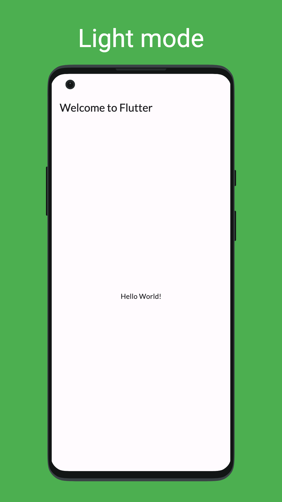
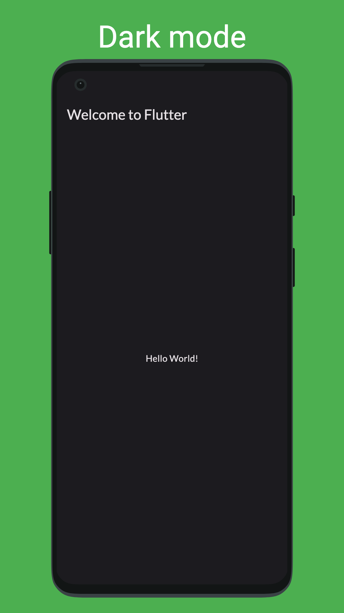

# app_store_screenshots

A flutter tool to generate screenshots and other assets for app stores.

<table>
<tr>
<td></td>
<td></td>
</td>
</table>

## Getting Started

Add dependency

```yaml
app_store_screenshots:
    git: https://github.com/defuncart/app_store_screenshots
```

Add `test/app_store_screenshots/generate_screenshots_test.dart`

```dart
void main() {
  generateAppStoreScreenshots(
    onSetUp: () {},
    config: (
      devices: [AppStoreDeviceType.androidPortrait],
      locales: const [Locale('en')],
    ),
    screens: [
      (
        onBuildScreen: () => const Page1(),
        wrapper: null,
        onPostPumped: null,
        backgroundColor: Colors.green,
        text: {
          const Locale('en'): 'Light mode',
        },
        textStyle: TextStyle(
          fontSize: 96,
          color: Colors.white,
        ),
        theme: ThemeData.light(),
      ),
    ],
    onTearDown: () {},
    skip: false,
  );
}

class Page1 extends StatelessWidget {
  const Page1({super.key});

  @override
  Widget build(BuildContext context) {
    return Scaffold(
      appBar: AppBar(),
      body: const Center(
        child: Text('Hello world'),
      ),
    );
  }
}
```

Generate screenshots using

```sh
flutter test test/app_store_screenshots/ --update-goldens
```

or

```sh
dart run app_store_screenshots:screenshots
```

Screenshots can bee found in `assets_dev/screenshots`.

See [example/test/app_store_screenshots/generate_screenshots_test.dart](example/test/app_store_screenshots/generate_screenshots_test.dart) for full example.

## Roadmap

- Support iOS
- Support Android Tablets & Mobile Landscape
