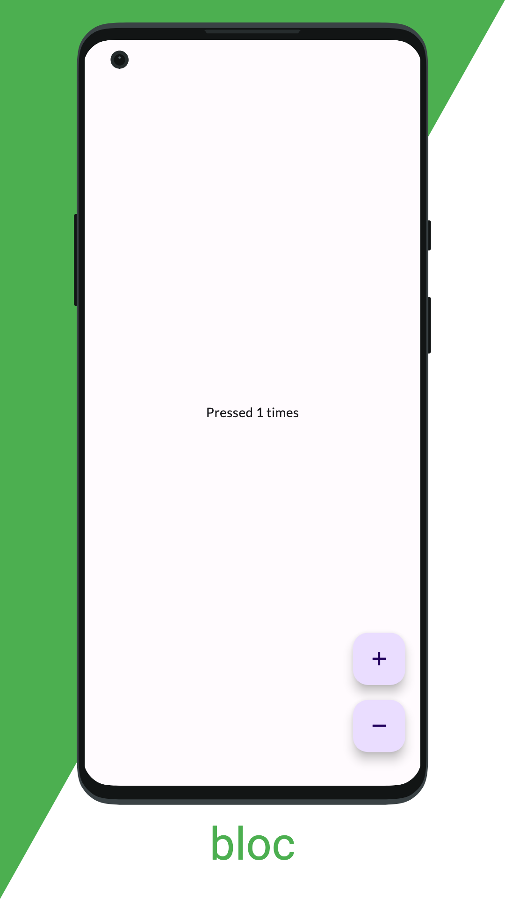

# app_store_screenshots

A flutter tool to generate screenshots and other assets for app stores.

<table>
<tr>
<td></td>
<td></td>
</tr>
<tr>
<td></td>
<td></td>
</tr>
</table>

## About

*app_store_screenshots* utilizes goldens, a Flutter testing tool, to generate assets:

```sh
flutter test --update-goldens --tags app_store_screenshots
```

To ensure that these tests do not interfere with your testing pipeline, exclude the tag `app_store_screenshots`:

```sh
flutter test --exclude-tags app_store_screenshots
```

## Getting Started

Add dependency:

```yaml
dev_dependency:
  app_store_screenshots:
      git: https://github.com/defuncart/app_store_screenshots
```

### Screenshots

`generateAppStoreScreenshots` can be used to generate screenshots for a given `ScreenshotsConfig` and `List<ScreenshotScenario>`.

```dart
final config = ScreenshotsConfig(
  devices: [DeviceType.androidPhonePortrait, DeviceType.iOSPhone67Portrait],
  locales: AppLocalizations.supportedLocales,
  localizationsDelegates: [
    GlobalMaterialLocalizations.delegate,
    GlobalWidgetsLocalizations.delegate,
    GlobalCupertinoLocalizations.delegate,
    AppLocalizations.delegate,
  ],
  background: ScreenshotBackground.solid(
    color: Colors.green,
  ),
  theme: ThemeData.light(),
  textStyle: TextStyle(color: Colors.white),
);
```

```dart
final screens = [
  ScreenshotScenario(
    onBuildScreen: () => const Page1(),
    text: {
      const Locale('en'): 'Light mode',
      const Locale('de'): 'Hellmodus',
    },
  ),
];
```

```dart
void main() {
  generateAppStoreScreenshots(
    config: config,
    screens: screens,
  );
}
```

Screenshots can be found in [example/assets_dev/screenshots/](example/assets_dev/screenshots/).

See [example/test/app_store_screenshots/generate_screenshots_test.dart](example/test/app_store_screenshots/generate_screenshots_test.dart) for full example.

#### Supported Devices

| DeviceType               | Description        | Resolution | Frame           |
| ------------------------ | ------------------ | ---------- | --------------- |
| androidPhonePortrait     | Android Phone      | 1080x1920  | One Plus 8 Pro  |
| androidPhoneLandscape    | Android Phone      | 1920x1080  | One Plus 8 Pro  |
| androidTablet7Portrait   | Android 7" Tablet  | 1080x1920  | Generic         |
| androidTablet7Landscape  | Android 7" Tablet  | 1920x1080  | Generic         |
| androidTablet10Portrait  | Android 10" Tablet | 1080x1920  | Generic         |
| androidTablet10Landscape | Android 10" Tablet | 1920x1080  | Generic         |
| iOSPhone47Portrait       | 4.7" iPhone        | 750x1334   | iPhone SE       |
| iOSPhone47Landscape      | 4.7" iPhone        | 750x1334   | iPhone SE       |
| iOSPhone55Portrait       | 5.5" iPhone        | 1242x2208  | iPhone 13 mini¹ |
| iOSPhone55Landscape      | 5.5" iPhone        | 2208x1242  | iPhone 13 mini¹ |
| iOSPhone65Portrait       | 6.5" iPhone        | 1242x2688  | iPhone 13 mini  |
| iOSPhone65Landscape      | 6.5" iPhone        | 2688x1242  | iPhone 13 mini  |
| iOSPhone67Portrait       | 6.7" iPhone        | 1290x2796  | iPhone 13 mini¹ |
| iOSPhone67Landscape      | 6.7" iPhone        | 2796x1290  | iPhone 13 mini¹ |
| iOSTablet129Portrait     | 12.9" iPad         | 2048x2732  | iPad 4th Gen    |
| iOSTablet129Landscape    | 12.9" iPad         | 2732x2048  | iPad 4th Gen    |
| linux                    |                    | 1920x1080  | Laptop          |
| macOS                    |                    | 1920x1080  | Laptop          |
| windows                  |                    | 1920x1080  | Laptop          |

¹Incorrect frame but correct resolution

### App Icon

Given an `AppIcon` widget, `generateAppIcon` and `generateAppIconAndroidForeground` can be used to generated 512x512 app icons and android foreground:

<table>
<tr><td>

```dart
generateAppIcon(
  onBuildIcon: () => const AppIcon(
    size: 512,
  ),
);
```
</td><td></td></tr>
<td>

```dart
generateAppIconAndroidForeground(
  onBuildIcon: () => const AppIcon(
    size: 512,
    hasTransparentBackground: true,
  ),
);
```
</td><td></td>
</tr>
</table>

Icons can be found in [example/assets_dev/app_icons/](example/assets_dev/app_icons/). [flutter_launcher_icons](https://pub.dev/packages/flutter_launcher_icons) could then be used to update the launcher icons for targeted platforms.

See [example/test/app_store_screenshots/generate_app_icons_test.dart](example/test/app_store_screenshots/generate_app_icons_test.dart) for full example.

### Google Play Assets

`generateGooglePlayFeatureGraphic` can be used to generate a 1024x500 feature graphic per locale for Google Play.

<table><tr>
<td></td>
<td></td>
</tr></table>

Assets can be found in [example/assets_dev/google_play_assets/](example/assets_dev/google_play_assets/).

See [example/test/app_store_screenshots/generate_google_play_assets_test.dart](example/test/app_store_screenshots/generate_google_play_assets_test.dart) for full example.

### Steam Assets

Icon, Cover and Background assets for programs in Steam Launcher can be generated as follows:

<table>
<tr><td>

```dart
generateStreamLogo(
  onBuildIcon: (size) => const SteamIcon(),
);
```
</td><td></td></tr>
<td>

```dart
generateStreamCover(
  onBuildCover: (size) => const SteamCover(),
);
```
</td><td></td></tr>
<td>

```dart
generateStreamBackground(
  onBuildBackground: (size) => const SteamBackground(),
);
```
</td><td></td></tr>
</table>

Assets can be found in [example/assets_dev/steam/](example/assets_dev/steam/).

See [example/test/app_store_screenshots/generate_steam_assets_test.dart](example/test/app_store_screenshots/generate_steam_assets_test.dart) for full example.

## Roadmap

- Add variable device position (i.e 75% visible, bottom not on screen)
- 0.0.1 release on pub.dev
- Add testing
