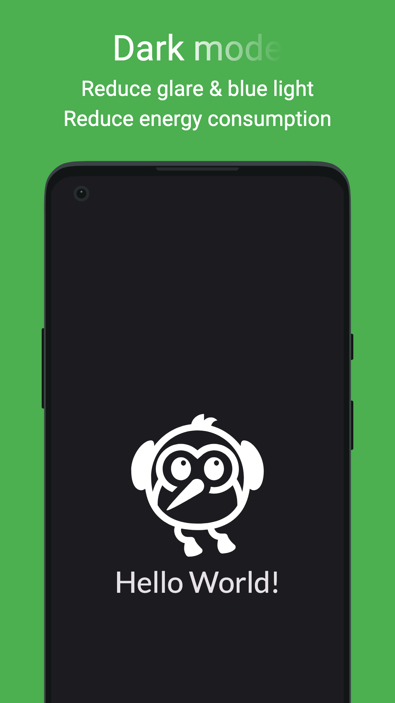

# app_store_screenshots

A flutter tool to generate screenshots and other assets for app stores.

<table>
<tr>
<td></td>
<td></td>
</td>
</table>

## Getting Started

Add dependency

```yaml
app_store_screenshots:
    git: https://github.com/defuncart/app_store_screenshots
```

### Screenshots

Add `test/app_store_screenshots/generate_screenshots_test.dart`

```dart
void main() {
  generateAppStoreScreenshots(
    onSetUp: () {},
    config: (
      devices: [AppStoreDeviceType.androidPortrait],
      locales: const [Locale('en')],
    ),
    screens: [
      (
        onBuildScreen: () => const Page1(),
        wrapper: null,
        onPostPumped: null,
        backgroundColor: Colors.green,
        text: {
          const Locale('en'): 'Light mode',
        },
        textStyle: TextStyle(
          fontSize: 96,
          color: Colors.white,
        ),
        theme: ThemeData.light(),
      ),
    ],
    onTearDown: () {},
    skip: false,
  );
}

class Page1 extends StatelessWidget {
  const Page1({super.key});

  @override
  Widget build(BuildContext context) {
    return Scaffold(
      appBar: AppBar(),
      body: const Center(
        child: Text('Hello world'),
      ),
    );
  }
}
```

Generate screenshots using

```sh
flutter test test/app_store_screenshots/ --update-goldens
```

or

```sh
dart run app_store_screenshots:screenshots
```

Screenshots can bee found in `assets_dev/screenshots`.

See [example/test/app_store_screenshots/generate_screenshots_test.dart](example/test/app_store_screenshots/generate_screenshots_test.dart) for full example.

#### Supported Devices

| DeviceType               | Description        | Resolution | Frame           |
| ------------------------ | ------------------ | ---------- | --------------- |
| androidPhonePortrait     | Android Phone      | 1080x1920  | One Plus 8 Pro  |
| androidPhoneLandscape    | Android Phone      | 1920x1080  | One Plus 8 Pro  |
| androidTablet7Portrait   | Android 7" Tablet  | 1080x1920  | Generic         |
| androidTablet7Landscape  | Android 7" Tablet  | 1920x1080  | Generic         |
| androidTablet10Portrait  | Android 10" Tablet | 1080x1920  | Generic         |
| androidTablet10Landscape | Android 10" Tablet | 1920x1080  | Generic         |
| iOSPhone47Portrait       | 4.7" iPhone        | 750x1334   | iPhone SE       |
| iOSPhone47Landscape      | 4.7" iPhone        | 750x1334   | iPhone SE       |
| iOSPhone55Portrait       | 5.5" iPhone        | 1242x2208  | iPhone 13 mini¹ |
| iOSPhone55Landscape      | 5.5" iPhone        | 2208x1242  | iPhone 13 mini¹ |
| iOSPhone65Portrait       | 6.5" iPhone        | 1242x2688  | iPhone 13 mini  |
| iOSPhone65Landscape      | 6.5" iPhone        | 2688x1242  | iPhone 13 mini  |
| iOSPhone67Portrait       | 6.7" iPhone        | 1290x2796  | iPhone 13 mini¹ |
| iOSPhone67Landscape      | 6.7" iPhone        | 2796x1290  | iPhone 13 mini¹ |
| iOSTablet129Portrait     | 12.9" iPad         | 2048x2732  | iPad 4th Gen    |
| iOSTablet129Landscape    | 12.9" iPad         | 2732x2048  | iPad 4th Gen    |
| linux                    |                    | 1920x1080  | Laptop          |
| macOS                    |                    | 1920x1080  | Laptop          |
| windows                  |                    | 1920x1080  | Laptop          |

¹ Incorrect frame but correct resolution

### App Icon

Given an `AppIcon` widget, `generateAppIcon` and `generateAppIconAndroidForeground` can be used to generated 512x512 app icons and android foreground:

<table>
<tr><td>

```dart
generateAppIcon(
  onBuildIcon: () => const AppIcon(
    size: 512,
  ),
);
```
</td><td></td></tr>
<td>

```dart
generateAppIconAndroidForeground(
  onBuildIcon: () => const AppIcon(
    size: 512,
    hasTransparentBackground: true,
  ),
);
```
</td><td></td>
</tr>
</table>

Icons can be found in `assets_dev/app_icons`. [flutter_launcher_icons](https://pub.dev/packages/flutter_launcher_icons) could then be used to update the launcher icons for targeted platforms.

See [example/test/app_store_screenshots/generate_app_icons_test.dart](example/test/app_store_screenshots/generate_app_icons_test.dart) for full example.

### Google Play Assets

`generateGooglePlayFeatureGraphic` can be used to generate a 1024x500 feature graphic per locale for Google Play.

<table><tr>
</td><td></td>
</td><td></td>
</tr></table>

Assets can be found in `assets_dev/google_play_assets`. 

See [example/test/app_store_screenshots/generate_google_play_assets_test.dart](example/test/app_store_screenshots/generate_google_play_assets_test.dart) for full example.

## Roadmap

- Add customizable backgrounds
- Add variable device position (i.e 75% visible, bottom not on screen)
- Add testing
